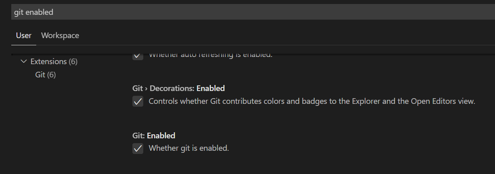

# git-github-vscode-integration
How to integrate Git, GitHub in Visual Studio Code

1.Install Git(version > 2.0.0) in your system (local computer) - https://git-scm.com/downloads
    Note: VS Code will leverage your machines Git installation

2.Check current Git Installation in your system (Win,macOS)
    $git --version
     
3.Create an account in GitHub - https://github.com

4.Create a new repository in GitHub - <DemoApp>

5.Copy the URL(HTTPS) of the Repo :  <https://github.com/venukokaz/DemoApp.git>

6.Verify if Git is Enables in VS Code settings :
   On Windows : Open VS Code -> File -> Preferences -> Settings -> Search for 'git enabled'
   On macOS   : Open VS Code -> Code -> Preferences -> Settings -> Search for 'git enabled'
   
   

References :
a. VS Code documentation on Version Control :  https://code.visualstudio.com/docs/editor/versioncontrol
b. 

